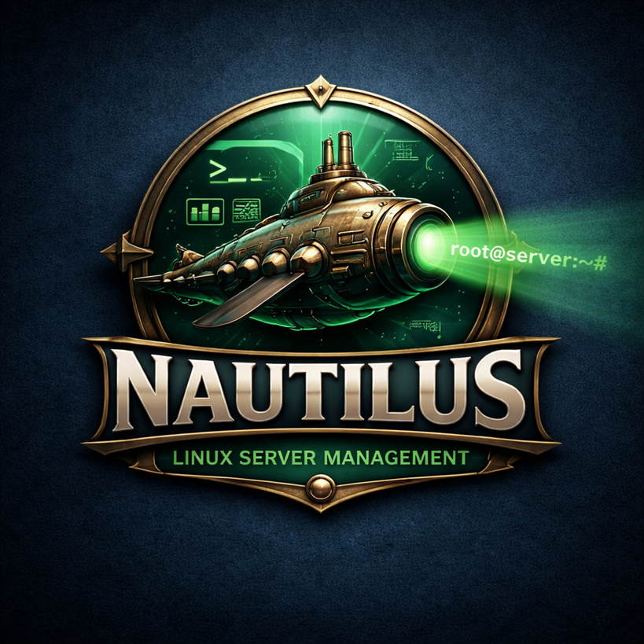
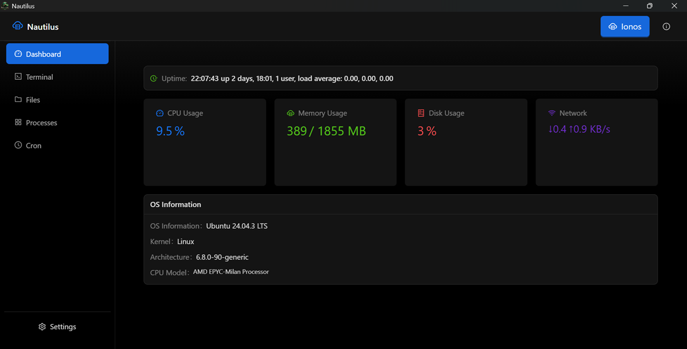
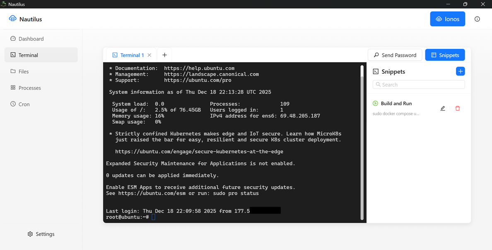

# 🌊 Nautilus - Server Manager

<div align="center">



**Modern and powerful desktop Linux server manager**

[](LICENSE)
[](https://tauri.app/)
[](https://react.dev/)
[](https://www.typescriptlang.org/)

</div>

---

## 📋 Table of Contents

- [About](#-about)
- [Key Features](#-key-features)
- [Screenshots](#-screenshots)
- [Technologies](#-technologies)
- [Architecture](#-architecture)
- [Requirements](#-requirements)
- [Installation](#-installation)
- [Development](#-development)
- [Distribution Build](#-distribution-build)
- [Usage Guide](#-usage-guide)
- [Project Structure](#-project-structure)
- [Security and Storage](#-security-and-storage)
- [Contributing](#-contributing)
- [License](#-license)

---

## 🎯 About

**Nautilus** is a cross-platform desktop application built with Tauri for professional Linux server management via SSH/SFTP. It offers a modern and intuitive interface with light/dark themes, allowing you to efficiently manage multiple servers through a single application.

The application combines the best of both worlds: the lightweight and secure Tauri (Rust) with the rich user experience of React + Ant Design Pro, resulting in a powerful and performant tool.

---

## ✨ Key Features

### 🔐 **Connection Management**
- Secure SSH connection storage
- Support for password or private key authentication
- Passwords encrypted in the operating system's secure vault (via keytar)
- Connectivity test before saving
- Multi-server management

### 📊 **Real-Time Dashboard**
- CPU, memory, and disk monitoring
- Network statistics (upload/download)
- System uptime
- Monitored services status (systemctl)
- Automatic metrics updates
- Interactive charts with Chart.js

### 💻 **Multi-Tab Terminal**
- Full terminal based on xterm.js
- Multiple simultaneous sessions
- Automatic size adjustment
- Command history
- ANSI color support
- Right-click paste
- One-click snippet execution

### 📁 **SFTP File Explorer**
- Complete remote file system navigation
- Upload and download files (drag & drop)
- Integrated code editor (CodeMirror)
- Multiple languages with syntax highlighting
- Image and video preview
- Create, rename, and delete files/directories
- Permission management
- Synchronized light/dark theme
- Directory tree collapse to maximize editor

### ⚙️ **Process Manager**
- Running process listing (via ps)
- Filter by name, user, or PID
- Detailed information (CPU, memory, user, time)
- Safe process termination with confirmation
- Automatic list refresh

### ⏰ **Cron Jobs Manager**
- User cron jobs visualization
- Create and edit scheduled tasks
- User-friendly interface for non-technical users
- Automatic log redirection support
- Execution log viewing
- Cron syntax validation

### 📝 **Reusable Snippets**
- Library of frequent commands
- Organization by categories
- Quick execution in active terminal
- Password snippets (secure sending)
- Create, edit, and delete via interface

### 🎨 **Modern Interface**
- Design based on Ant Design Pro
- Light and dark themes
- Smooth transitions and animations
- Responsive and adaptive
- Frameless window with custom controls
- "About" modal with system information

---

## 📸 Screenshots




---

## 🛠 Technologies

### Frontend
| Technology | Version | Purpose |
|-----------|---------|---------|
| **React** | 19.2.3 | UI Framework |
| **TypeScript** | 5.9.3 | Type safety |
| **Vite** | 7.3.0 | Build tool and dev server |
| **Ant Design** | 5.29.2 | UI Components |
| **Ant Design Pro** | 2.8.10 | Advanced components |
| **Chart.js** | 4.4.2 | Charts and visualizations |
| **CodeMirror** | 4.25.4 | Code editor |
| **xterm.js** | 5.3.0 | Terminal emulator |
| **dayjs** | 1.11.19 | Date manipulation |

### Desktop (Tauri)
| Technology | Version | Purpose |
|-----------|---------|---------|
| **Tauri** | 2.9.6 | Desktop framework (Rust) |
| **@tauri-apps/api** | 2.9.1 | Tauri APIs |
| **Plugins** | 2.x | Dialog, FS, Shell |

### Backend (Sidecar)
| Technology | Version | Purpose |
|-----------|---------|---------|
| **Node.js** | 18+ | Runtime |
| **TypeScript** | 5.3.0 | Type safety |
| **ssh2** | 1.15.0 | SSH/SFTP client |
| **keytar** | 7.9.0 | Password management |
| **winston** | 3.13.0 | Logging system |
| **pkg** | 5.8.1 | Executable packager |

---

## 🏗 Architecture

```
┌─────────────────────────────────────────────────────────────┐
│                    Tauri Application (Rust)                  │
│                    Native Desktop Window                     │
└─────────────────────────────────────────────────────────────┘
                              │
              ┌───────────────┴───────────────┐
              │                               │
    ┌─────────▼─────────┐         ┌──────────▼──────────┐
    │   React Frontend   │◄───────►│  Backend Sidecar   │
    │  (TypeScript/Vite) │  HTTP   │   (Node.js/TS)     │
    │                    │  :45678 │                     │
    └────────────────────┘         └──────────┬──────────┘
                                              │
                                              │ SSH/SFTP
                                              ▼
                                   ┌──────────────────────┐
                                   │   Linux Server(s)    │
                                   └──────────────────────┘
```

### Data Flow

1. **Frontend (React/TypeScript)**: User interface rendered in Tauri's webview
2. **Tauri (Rust)**: Manages native window and system resources
3. **Backend Sidecar (Node.js)**: 
   - Runs as packaged child process
   - Manages SSH/SFTP connections
   - Maintains terminal sessions
   - Collects server metrics
   - Stores connections and snippets locally
4. **Communication**: Frontend ↔ Backend via HTTP REST (localhost:45678)
5. **Persistence**: 
   - Data in JSON files in the system's `userData` directory
   - Passwords in native OS vault via keytar

---

## 📦 Requirements

### For Development

- **Node.js** 18 or higher
- **npm** (included with Node.js)
- **Rust** (to compile Tauri)
  - Install via [rustup](https://rustup.rs/)
- **OS-specific build tools**:
  - **Windows**: Visual Studio Build Tools with C++ toolchain
  - **Linux**: `build-essential`, `libssl-dev`, `libsoup-3.0-dev`, `webkit2gtk-4.1-dev`
  - **macOS**: Xcode Command Line Tools

### For Use

- **Remote server** running Linux
- **SSH enabled** on server
- **Required commands** on server (for full functionality):
  - `uptime`, `free`, `df`, `top`, `ps`, `kill`
  - `systemctl` (for service monitoring)
  - `/proc/net/dev` (for network statistics)

---

## 🚀 Installation

### Quick Installation

```bash
# 1. Clone the repository
git clone https://github.com/your-username/Nautilus.git
cd Nautilus

# 2. Install frontend dependencies
npm install

# 3. Install backend dependencies
cd backend && npm install && cd ..

# 4. Ready! Now you can start development
npm run tauri:dev
```

---

## 💻 Development

### Development Mode with Tauri (Recommended)

```bash
npm run tauri:dev
```

This command will:
1. Compile backend TypeScript
2. Package backend as executable
3. Start Vite dev server (hot reload)
4. Open Tauri window

### Frontend-Only Development Mode

Useful for quick UI development without desktop:

```bash
# Terminal 1 - Frontend (http://localhost:5173)
npm run dev

# Terminal 2 - Backend
cd backend && npm run dev
```

### Available Scripts

#### Main Scripts (project root)

```bash
npm run dev              # Start Vite frontend only
npm run build            # Compile frontend
npm run preview          # Preview frontend build
npm run tauri:dev        # Full development (frontend + backend + Tauri)
npm run tauri:build      # Full production build
npm run build:backend    # Compile and package backend
```

#### Backend Scripts (`cd backend`)

```bash
npm run dev              # Development with hot-reload (tsx watch)
npm start                # Run compiled backend
npm run build            # Full build (TS + pkg Windows)
npm run build:ts         # Compile TypeScript only
npm run build:pkg:win    # Package for Windows
npm run build:pkg:linux  # Package for Linux
npm run build:pkg:mac    # Package for macOS
npm run build:all        # Package for all platforms
npm run typecheck        # Check types without compiling
```

### Native Module Rebuilding

If you encounter issues with native modules like `keytar`, especially after switching Node.js versions:

```bash
cd backend
npm rebuild keytar
```

---

## 📦 Distribution Build

### Full Production Build

```bash
npm run tauri:build
```

This command will automatically execute:

1. ✅ Install backend dependencies
2. ✅ Compile backend TypeScript
3. ✅ Package backend as executable (pkg)
4. ✅ Compile frontend (Vite)
5. ✅ Build Tauri for current OS
6. ✅ Generate installers

### Multi-Platform Build

To generate backend executables for all platforms:

```bash
cd backend
npm run build:all
```

This will create:
- `nautilus-backend-x86_64-pc-windows-msvc.exe` (Windows)
- `nautilus-backend-x86_64-unknown-linux-gnu` (Linux)
- `nautilus-backend-x86_64-apple-darwin` (macOS)

**Note**: Tauri build can only be done natively on each platform. To create Windows installers, compile on Windows; for macOS, compile on macOS, etc.

### Build Output

After building, you'll find:

#### Tauri Installers
📁 `src-tauri/target/release/bundle/`

- **Windows**: 
  - `Nautilus_1.0.0_x64.msi` (MSI Installer)
  - `Nautilus_1.0.0_x64_en-US.msi` (Localized)
- **Linux**: 
  - `nautilus_1.0.0_amd64.AppImage` (Portable AppImage)
  - `nautilus_1.0.0_amd64.deb` (Debian package)
- **macOS**: 
  - `Nautilus_1.0.0_x64.dmg` (DMG Installer)

#### Backend Sidecar
📁 `src-tauri/binaries/`

- Compiled and packaged backend for each platform

#### Compiled Frontend
📁 `dist/`

- Compiled and optimized React application

---

## 📖 Usage Guide

### 1️⃣ First Run

When opening Nautilus for the first time:

1. **Welcome Screen**: Wait for backend initialization
2. **Click "Enter"**: Access main interface
3. **No connections found**: You'll see a prompt to create your first connection

### 2️⃣ Managing Connections

#### Create New Connection

1. Click **"+ New Connection"** button in sidebar
2. Fill in the data:
   - **Name**: Friendly identifier (e.g., "Production Server")
   - **Host**: IP or hostname (e.g., `192.168.1.100` or `server.example.com`)
   - **Port**: SSH port (default: 22)
   - **Username**: SSH username
   - **Authentication Method**: 
     - **Password**: Enter password (will be stored securely)
     - **Private Key**: Select key file (e.g., `~/.ssh/id_rsa`)
3. Click **"Test & Save"**
4. Wait for connection validation

#### Connect to a Server

1. Select connection from sidebar list
2. Wait for dashboard to load
3. Status icon will turn green when connected

### 3️⃣ Dashboard

After connecting, you'll see:

- **Real-Time Metrics**:
  - 🔄 CPU Usage (%)
  - 💾 RAM Memory (used/total)
  - 💿 Disk Space (/)
  - 🌐 Network Traffic (RX/TX)
  - ⏱️ System Uptime
  
- **Monitored Services**:
  - Service status via systemctl
  - Visual indication (active/inactive)

### 4️⃣ Terminal

#### Open Terminal

1. Click **"Terminal"** tab in top menu
2. Click **"+"** button to create new tab
3. Type commands normally
4. Use **Ctrl+C** to interrupt processes

#### Special Features

- **Multiple Tabs**: Manage several sessions simultaneously
- **Rename Tab**: Right-click on tab
- **Paste**: Right-click in terminal area
- **Snippets**: Click a snippet in sidebar to execute

### 5️⃣ Files (SFTP)

#### Navigation

1. Click **"Files"** tab
2. Use directory tree on left to navigate
3. Click **collapse** icon to maximize editor

#### Upload Files

- **Method 1**: Click "Upload" button and select files
- **Method 2**: Drag and drop files into interface

#### Download Files

- Right-click on file → "Download"
- Choose destination location

#### Edit Files

1. Double-click on a text file
2. CodeMirror editor will open
3. Make changes
4. Press **Ctrl+S** to save
5. Editor theme follows application theme

#### Create/Delete

- **New File**: "New File" button → Enter name
- **New Folder**: "New Folder" button → Enter name
- **Delete**: Right-click → "Delete" → Confirm

### 6️⃣ Processes

1. Click **"Processes"** tab
2. View running processes list
3. Use **search bar** to filter by:
   - Process name
   - PID
   - User
4. Click **"Refresh"** to reload list
5. To terminate a process:
   - Click **"Kill"** button
   - Confirm action

### 7️⃣ Cron Jobs

#### View Cron Jobs

1. Click **"Cron"** tab
2. See all user cron jobs
3. Jobs with logs have **"View Log"** button

#### Create New Cron Job

1. Click **"New Cron Job"**
2. Configure:
   - **Minute** (0-59 or *)
   - **Hour** (0-23 or *)
   - **Day of Month** (1-31 or *)
   - **Month** (1-12 or *)
   - **Day of Week** (0-6 or *, 0=Sunday)
   - **Command**: Command to execute
   - **Log**: Enable to redirect output to file
3. Click **"Save"**

#### Edit/Delete

- **Edit**: Click edit icon → Modify → Save
- **Delete**: Click trash icon → Confirm

### 8️⃣ Snippets

#### Create Snippet

1. Click **"Snippets"** in sidebar
2. Click **"+"**
3. Fill in:
   - **Name**: Identifier
   - **Command**: Command to execute
   - **Category** (optional)
4. Save

#### Use Snippet

1. Have a terminal open
2. Click snippet in list
3. Command will be executed automatically in active terminal

#### Password Snippet

To send passwords securely:

1. Create a snippet
2. Mark as **"Type: Password"**
3. Enter password
4. When clicked, password is sent without appearing in terminal

### 9️⃣ Themes

Switch between light and dark themes:

- Click **🌙/☀️** icon in top right corner
- Theme is applied instantly across entire application
- Includes: UI, terminal, code editor, charts

### 🔟 System Information

- Click **"i"** icon in top right corner
- View Nautilus information
- Version, credits, etc.

---

## 📂 Project Structure

```
Nautilus/
│
├── 📁 src/                           # React + TypeScript Frontend
│   ├── 📁 assets/                    # Images and static resources
│   │   └── splash-screen.png
│   ├── 📁 components/                # Reusable React components
│   │   ├── SplashScreen.tsx
│   │   ├── 📁 cron/                  # Cron management components
│   │   ├── 📁 dashboard/             # Dashboard cards and charts
│   │   ├── 📁 files/                 # SFTP file explorer
│   │   ├── 📁 modals/                # Modals (About, Connections, etc)
│   │   ├── 📁 processes/             # Process manager
│   │   └── 📁 terminal/              # xterm.js terminal
│   ├── 📁 context/                   # React contexts
│   │   ├── ConnectionContext.tsx     # Global connection state
│   │   └── ThemeContext.tsx          # Theme management
│   ├── 📁 hooks/                     # Custom hooks
│   ├── 📁 layouts/                   # Main layouts
│   │   └── MainLayout.tsx            # Layout with sidebar and header
│   ├── 📁 theme/                     # Ant Design theme configuration
│   │   └── themeConfig.ts
│   ├── 📁 utils/                     # Utility functions
│   ├── App.tsx                       # Root component
│   ├── main.tsx                      # React entry point
│   ├── index.css                     # Global styles
│   ├── tauri-bridge.ts               # Backend communication bridge
│   └── types.ts                      # TypeScript type definitions
│
├── 📁 src-tauri/                     # Tauri Application (Rust)
│   ├── 📁 src/                       # Rust code
│   │   ├── main.rs                   # Tauri entry point
│   │   └── lib.rs
│   ├── 📁 icons/                     # Application icons
│   ├── 📁 binaries/                  # Compiled backend sidecar
│   │   └── nautilus-backend-*.exe
│   ├── 📁 target/                    # Build output
│   │   └── release/
│   │       └── bundle/               # Installers (.msi, .deb, .dmg)
│   ├── tauri.conf.json               # Tauri configuration
│   ├── Cargo.toml                    # Rust dependencies
│   └── build.rs
│
├── 📁 backend/                       # Node.js Backend (Sidecar)
│   ├── 📁 src/                       # TypeScript code
│   │   ├── index.ts                  # HTTP server + routes
│   │   ├── 📁 models/                # Data models
│   │   │   ├── Connection.ts
│   │   │   ├── Snippet.ts
│   │   │   └── Terminal.ts
│   │   ├── 📁 services/              # Business logic
│   │   │   ├── ConnectionService.ts  # Connection CRUD
│   │   │   ├── SSHService.ts         # SSH management
│   │   │   ├── SFTPService.ts        # SFTP operations
│   │   │   ├── MetricsService.ts     # Metrics collection
│   │   │   ├── ProcessService.ts     # Process listing and kill
│   │   │   ├── CronService.ts        # Cron management
│   │   │   └── SnippetService.ts     # Snippet CRUD
│   │   ├── 📁 types/                 # TypeScript types
│   │   │   └── index.ts
│   │   └── 📁 utils/                 # Helper functions
│   │       └── logger.ts             # Logging system (winston)
│   ├── 📁 dist/                      # Compiled TypeScript
│   ├── package.json
│   ├── tsconfig.json
│   └── pkg.json                      # pkg configuration
│
├── 📁 dist/                          # Compiled frontend (Vite)
├── 📁 node_modules/                  # npm dependencies
├── 📁 .vscode/                       # VS Code settings
├── 📁 .agent/                        # Agent configurations
│
├── package.json                      # Main dependencies and scripts
├── package-lock.json
├── tsconfig.json                     # TypeScript config (frontend)
├── vite.config.ts                    # Vite config
├── postcss.config.js                 # PostCSS config
├── .gitignore
├── LICENSE                           # MIT License
└── README.md                         # This file
```

---

## 🔒 Security and Storage

### Local Data

Nautilus stores data locally in the system's `userData` directory:

- **Windows**: `%APPDATA%\nti.nautilus\`
- **Linux**: `~/.config/nti.nautilus/`
- **macOS**: `~/Library/Application Support/nti.nautilus/`

Stored files:

```
userData/
├── connections.json       # Connection list (without passwords)
├── snippets.json          # Snippet library
└── logs/                  # Backend logs (winston)
    └── application-YYYY-MM-DD.log
```

### Secure Password Storage

SSH passwords are **NEVER** stored in plain text. Nautilus uses the `keytar` library, which:

- **Windows**: Uses Windows Credential Manager
- **Linux**: Uses libsecret (GNOME Keyring/KWallet)
- **macOS**: Uses macOS Keychain

Each password is stored with a unique key based on connection ID:

```
Service: nautilus-ssh
Account: connection-{uuid}
Password: (encrypted by OS)
```

### Private Keys

When using private key authentication:

- Nautilus reads the key file **only** during connection
- The key is **never** copied or stored
- Only the **path** to the key is saved in `connections.json`

### Network Traffic

- ✅ All SSH/SFTP connections are **encrypted** (standard SSH protocol)
- ✅ Frontend ↔ Backend communication is via `localhost` (doesn't leave machine)
- ✅ No data is sent to external servers
- ✅ No telemetry or tracking

### Best Practices

To maximize security:

1. ✅ Use SSH keys instead of passwords when possible
2. ✅ Keep your private keys protected with passphrase
3. ✅ Don't share the `connections.json` file
4. ✅ Run Nautilus only on trusted machines
5. ✅ Keep the application always updated

---

## 🤝 Contributing

Contributions are welcome! To contribute:

### Report Bugs

1. Check if the bug has already been reported in [Issues](https://github.com/your-username/Nautilus/issues)
2. Create a new issue with:
   - Clear problem description
   - Steps to reproduce
   - Operating system and version
   - Relevant logs (if applicable)

### Suggest Features

1. Open an issue with the `enhancement` tag
2. Describe the desired feature
3. Explain the use case

### Pull Requests

1. Fork the project
2. Create a branch for your feature (`git checkout -b feature/MyNewFeature`)
3. Commit your changes (`git commit -m 'Add MyNewFeature'`)
4. Push to the branch (`git push origin feature/MyNewFeature`)
5. Open a Pull Request

### Code Guidelines

- Use TypeScript for all new code
- Follow existing code style
- Add comments to complex code
- Test your changes before submitting

---

## 📜 License

This project is licensed under the **MIT License**.

```
MIT License

Copyright (c) 2025 Ricardo Borges

Permission is hereby granted, free of charge, to any person obtaining a copy
of this software and associated documentation files (the "Software"), to deal
in the Software without restriction, including without limitation the rights
to use, copy, modify, merge, publish, distribute, sublicense, and/or sell
copies of the Software, and to permit persons to whom the Software is
furnished to do so, subject to the following conditions:

The above copyright notice and this permission notice shall be included in all
copies or substantial portions of the Software.

THE SOFTWARE IS PROVIDED "AS IS", WITHOUT WARRANTY OF ANY KIND, EXPRESS OR
IMPLIED, INCLUDING BUT NOT LIMITED TO THE WARRANTIES OF MERCHANTABILITY,
FITNESS FOR A PARTICULAR PURPOSE AND NONINFRINGEMENT. IN NO EVENT SHALL THE
AUTHORS OR COPYRIGHT HOLDERS BE LIABLE FOR ANY CLAIM, DAMAGES OR OTHER
LIABILITY, WHETHER IN AN ACTION OF CONTRACT, TORT OR OTHERWISE, ARISING FROM,
OUT OF OR IN CONNECTION WITH THE SOFTWARE OR THE USE OR OTHER DEALINGS IN THE
SOFTWARE.
```

See the [LICENSE](LICENSE) file for more details.

---

## 🙏 Acknowledgments

- [Tauri](https://tauri.app/) - Amazing desktop framework
- [React](https://react.dev/) - Powerful UI library
- [Ant Design](https://ant.design/) - Complete design system
- [xterm.js](https://xtermjs.org/) - Terminal emulator
- [CodeMirror](https://codemirror.net/) - Code editor
- [ssh2](https://github.com/mscdex/ssh2) - SSH client for Node.js
- Open-source community

---

<div align="center">

**⭐ If you liked Nautilus, consider giving the project a star!**

</div>
