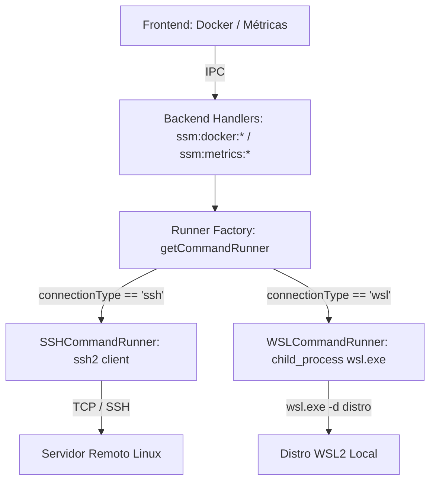

# Design Doc: Conexão Nativa WSL2 e Gerenciamento Docker no Nautilus

- **Data:** 2026-09-28
- **Status:** Aprovado
- **Autores:** Antigravity & Ricardo Borges
- **Caminho:** `docs/superpowers/specs/2026-09-28-wsl2-docker-connection-design.md`

---

## 1. Contexto & Motivação

Muitos desenvolvedores no ecossistema Windows executam containers Docker localmente através do **WSL2** (seja via Docker Desktop com backend WSL2 ou Docker Engine nativo rodando dentro de uma distribuição Linux como Ubuntu/Debian).

Atualmente, o **Nautilus** suporta apenas conexões remotas via SSH e RDP. Para utilizar a aba Docker no ambiente de desenvolvimento local, o usuário precisaria configurar manualmente um servidor OpenSSH dentro do WSL2 — um processo com atrito (sem SSH ativo por padrão, IPs dinâmicos de VM, gerenciamento de chaves e serviços).

Ao permitir a criação de uma **Conexão Nativa WSL2** (`connectionType: 'wsl'`), o Nautilus se conecta diretamente à máquina virtual WSL2 através do executável `wsl.exe` do Windows, permitindo gerenciar containers (Docker Dashboard), coletar métricas de saúde da VM e inspecionar logs com baixíssima latência e sem necessidade de rede/SSH configurado.

---

## 2. Objetivos e Não-Objetivos

### Objetivos (V1)
- **Detecção de Ambiente:** Detectar se o Nautilus está rodando no Windows com WSL2 instalado.
- **Listagem de Distros:** Listar automaticamente todas as distribuições instaladas (`wsl.exe --list --quiet`) no formulário de criação de conexão.
- **Gerenciamento Docker Completo:** Habilitar todas as funcionalidades da aba Docker do Nautilus no WSL2:
  - Listagem de containers com status, portas, IPs e stacks (`docker ps`).
  - Ações no ciclo de vida: `start`, `stop`, `restart`, `pause`, `unpause`, `remove`.
  - Estatísticas de consumo em tempo real (`docker stats`).
  - Gerenciamento de Imagens, Volumes, Redes e Stacks.
  - Visualização de Logs dos containers (`docker logs`).
- **Métricas do Sistema:** Coleta em tempo real de uso de CPU, Memória, Disco e Uptime da VM WSL2.
- **Identidade Visual:** Exibição de ícone característico (Linux/Tux/WSL) na barra lateral e nas abas de conexões abertas.

### Não-Objetivos (Futuras Iterações)
- **Terminal PTY Interativo do WSL:** Manter o escopo focado em Docker, Métricas e Logs na V1 (evita a complexidade de compilação de bibliotecas nativas de PTY como `node-pty` no empacotador `pkg`).
- **Gerenciador de Arquivos SFTP/UNC:** Acesso à árvore de arquivos do WSL será abordado em release dedicada.

---

## 3. Arquitetura da Solução

### 3.1 Padrão `CommandRunner` (Desacoplamento do Transporte)

Atualmente, os handlers no backend (`backend/src/index.ts`) instanciam `new SSHClient(authConfig)`. Para tornar a execução de comandos transparente entre servidores remotos e distribuições locais, introduzimos a abstração `CommandRunner`:

### 3.2 Componentes e Arquivos

#### A. Camada de Execução (`backend/src/features/execution/`)
1. **`command-runner.interface.ts`**:
   - `CommandResult`: `{ stdout: string; stderr: string; code: number }`
   - `CommandRunner`: `exec(command: string, options?: { timeout?: number }): Promise<CommandResult>`
2. **`ssh-command-runner.ts`**:
   - Encapsula o `SSHClient` existente para conexões SSH.
3. **`wsl-command-runner.ts`**:
   - Invoca `wsl.exe` com argumentos: `['-d', distro, '--', 'sh', '-c', command]`.
   - Se um usuário for especificado, adiciona `['-u', user]`.
   - Executa via `child_process.execFile` com buffer.
   - Decodifica automaticamente saída UTF-16LE com *null bytes* ou UTF-8.
   - Aplica timeout seguro (padrão de 30 segundos) para evitar bloqueio de processos.
4. **`runner.factory.ts`**:
   - Função `getCommandRunner(connection: Connection): Promise<CommandRunner>`.

#### B. Endpoints IPC no Backend (`backend/src/index.ts`)
- **`ssm:wsl:isAvailable`**: Retorna `{ available: boolean }` verificando `process.platform === 'win32'` e invocando `wsl.exe --status`.
- **`ssm:wsl:listDistros`**: Retorna `{ distros: string[], defaultDistro?: string }` executando `wsl.exe --list --quiet` com sanitização dos nomes das distribuições.
- **Refatoração dos handlers `ssm:docker:*`**:
  - `ssm:docker:check`
  - `ssm:docker:list`
  - `ssm:docker:action`
  - `ssm:docker:stats`
  - `ssm:docker:images`
  - `ssm:docker:imageAction`
  - `ssm:docker:volumes`
  - `ssm:docker:volumeAction`
  - `ssm:docker:networks`
  - `ssm:docker:networkAction`
  - `ssm:docker:stacks`
  - `ssm:docker:logs`
  - `ssm:docker:composeUp`
  - `ssm:docker:composeDown`
  Todos obtêm o runner via `await getCommandRunner(conn)` e invocam `runner.exec(...)`.

#### C. Métricas do Sistema (`backend/src/features/metrics/metrics.service.ts`)
- `SystemMonitor` passa a aceitar `CommandRunner` (ou instanciar via `getCommandRunner`), permitindo que comandos Linux como `free -m`, `uptime`, `df -h /`, `top` e `/proc/net/dev` rodem perfeitamente na VM WSL2.

#### D. Modelo de Dados & Tipos
- **`src/types.ts`** e **`backend/src/shared/types/index.ts`**:
  - `connectionType: 'ssh' | 'rdp' | 'wsl'`
  - `wslDistro?: string`
  - `wslUser?: string`
- **`backend/src/features/connections/connection.model.ts`**:
  - Mapeamento e persistência de `wslDistro` e `wslUser`.

#### E. Frontend UI
1. **`src/tauri-bridge.ts`**:
   - Declaração de `wslIsAvailable()` e `wslListDistros()` na interface `Window.ssm`.
2. **`src/components/modals/ConnectionModal.tsx`**:
   - Checagem inicial de disponibilidade do WSL.
   - Exibição condicional da opção **WSL2** no seletor de tipo de conexão.
   - Dropdown com distros detectadas dinamicamente.
   - Ocultação dos campos de rede/autenticação (host, port, senha, chave).
3. **`src/components/connections/ConnectionManager.tsx` e `ConnectionTabs.tsx`**:
   - Renderização de ícone específico para conexões WSL (Linux icon).
4. **`src/context/ConnectionContext.tsx`**:
   - Ignora a verificação de chave de host SSH para conexões WSL.
   - Inicia métricas e verificação de Docker da mesma forma que conexões Linux.

---

## 4. Tratamento de Erros e Casos de Borda

1. **WSL2 em estado Stopped (Cold Start):**
   - Ao executar qualquer comando via `wsl.exe`, o Windows inicializa a VM automaticamente. A primeira chamada pode levar entre 1 e 2 segundos. O timeout padrão de 30 segundos garante que a inicialização ocorra sem falso positivo de erro.
2. **Docker Service parado no WSL:**
   - Se o Docker Daemon não estiver ativo na distro, `docker ps` retorna erro de comunicação com o socket. O handler `ssm:docker:check` captura isso e retorna `{ available: false }`, e a UI orienta o usuário a iniciar o serviço (`sudo service docker start`).
3. **Encoding UTF-16LE no Windows:**
   - Comandos administrativos do `wsl.exe` no Windows enviam saída em UTF-16LE. O decodificador com buffer no `WSLCommandRunner` trata tanto UTF-16LE quanto UTF-8 de forma transparente.
4. **Permissões do Socket (`/var/run/docker.sock`):**
   - Caso o usuário não pertença ao grupo `docker`, comandos de verificação detectam a falta de permissão e utilizam o fallback ou reportam a necessidade de inclusão no grupo `docker`.

---

## 5. Plano de Validação & Testes

1. **Testes Unitários:**
   - Testar `WSLCommandRunner` e `SSHCommandRunner` mockando `child_process.execFile` e `ssh2`.
   - Testar sanitização de lista de distros e decodificação UTF-16LE.
2. **Testes de Integração:**
   - Adicionar uma conexão WSL2 apontando para a distro `Ubuntu`.
   - Abrir a conexão no Nautilus e validar:
     - Métricas de CPU/Memória/Disco em tempo real.
     - Detecção do Docker ativado.
     - Listagem de todos os 15 containers ativos identificados no Spike.
     - Execução de ações (start/stop/restart/logs) nos containers.
